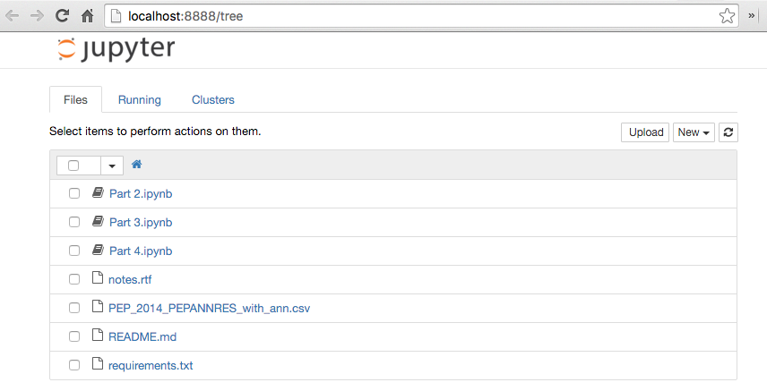
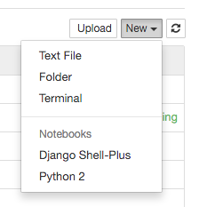
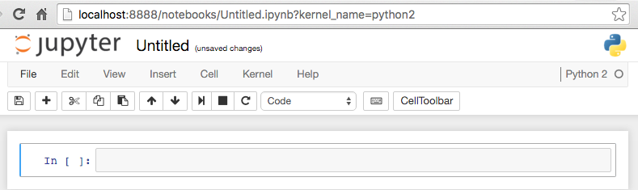
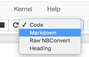

# Introduction to Jupyter Notebook

Jupyter Notebook is a system for using a web browser to experiment with code and data and to write basic HTML notes to explain what's going on.

Technically, Jupyter can be used with code written in many languages, but we're only going to talk about python, and we're going to focus on just enough to get you started. If you really get into it, there are plenty of resources on the web to lead you deeper into Jupyter.

Below, if you see a line with a `$` character at the beginning, that `$` represents a terminal (or shell) "prompt." **Don't type the `$` when typing in commands.**

## Starting Jupyter Notebook

If you have it installed, this is really simple.

    $ jupyter notebook

A web browser should open (or come to the foreground). It will look something like this:

You can pass arguments to the `jupyter notebook` to open a specific notebook right away, or to open in another directory. Or you can just click on the notebook name. You can also make a new notebook (among other things) by clicking on the "New" menu on the right.

For now, click on `Python 2` to launch a new notebook running a Python 2 kernel. It should open in a new tab, and look something like this.

## Notebook basics

A notebook is made up of any number of cells. A cell has a type, `code` or `markdown`. There's a menu in the toolbar which you can use to change the current cell type. When the menu is closed, it tells you the type. (You can also recognize a `code` cellby the presence of `In [ ]:` at the left edge of the cell.

You can also change the cell type with keyboard shortcuts. You can get the list of keyboard shortcuts from the **Help** menu (right above the cell type menu). Note, though, that the keyboard shortcuts are in a tooltip, so you can't read them while editing. You may want to open a [third-party shortcut reference](https://sowingseasons.com/blog/reference/2016/01/jupyter-keyboard-shortcuts/23298516) in a new window.

We're going to dive into using the notebook, but if you're still feeling a little unsure, notice that everything in the toolbar will show a tooltip if you linger over it. Also, check out the Help menu for more info, but be warned that as of this writing, some of the options link to slightly outdated documentation.

## Running code

Most of the time you'll use cells to run python code. Jupyter is pretty magical. It has excellent tab-completion, although you may need to _run_ a cell that imports the code before the completion will work.

In addition to tab-completion, you can type _shift-tab_ to get help on a command, which is a great way to remind yourself of syntax details. Pressing _shift-tab_ a second time grows the help display, and pressing it a third consecutive time opens it in a split pane. Try it out!

Remember that, for each notebook, Jupyter manages an isolated "kernel" that executes code in the relevant language (again, usually python) and maintains variable values and other state. So even though you are looking at a notebook page from top to bottom, every time you run code, jupyter just executes that cell's code in the kernel. If you move up and down editing, you may see some slightly surprising situations. If you are making a notebook for other people and want to make sure everything is as it would be if you went in order, use the **Kernel** menu to _Restart & Clear Output_ or _Restart & Run All_. But don't worry about it too much.

Technically, Jupyter python code is **IPython** code. This means that you can do a number of common shell commands like `ls` and `cd` as well as executing a number of ["magic" commands](http://ipython.readthedocs.org/en/stable/interactive/magics.html) like `%who`, which will show you all the variables you've defined in your current kernel. Like other shells, learning some of the tricks that `IPython` supports can really make you more fluent when exploring code, but we're not going to go down that rabbit hold today.

## Writing Markdown

Remember that writing documentation is as much for your future self as for anyone else, so don't forget to keep track of what you do and why. In Jupyter, you do this with markdown cells. [Markdown](http://jupyter-notebook.readthedocs.org/en/latest/examples/Notebook/rstversions/Working%20With%20Markdown%20Cells.html) is a text-editor friendly way to create HTML, and when you _run_ a markdown cell, Jupyter will interpret the markdown and replace the raw markdown with rendered HTML.

If you're used to Github, note that Jupyter supports "Github Flavored Markdown" (GFM), which is nice for syntax-highlighted code blocks and HTML table markup. And, of course, Markdown is a superset of HTML, so you can also use HTML tags if you don't remember the Markdown syntax.
